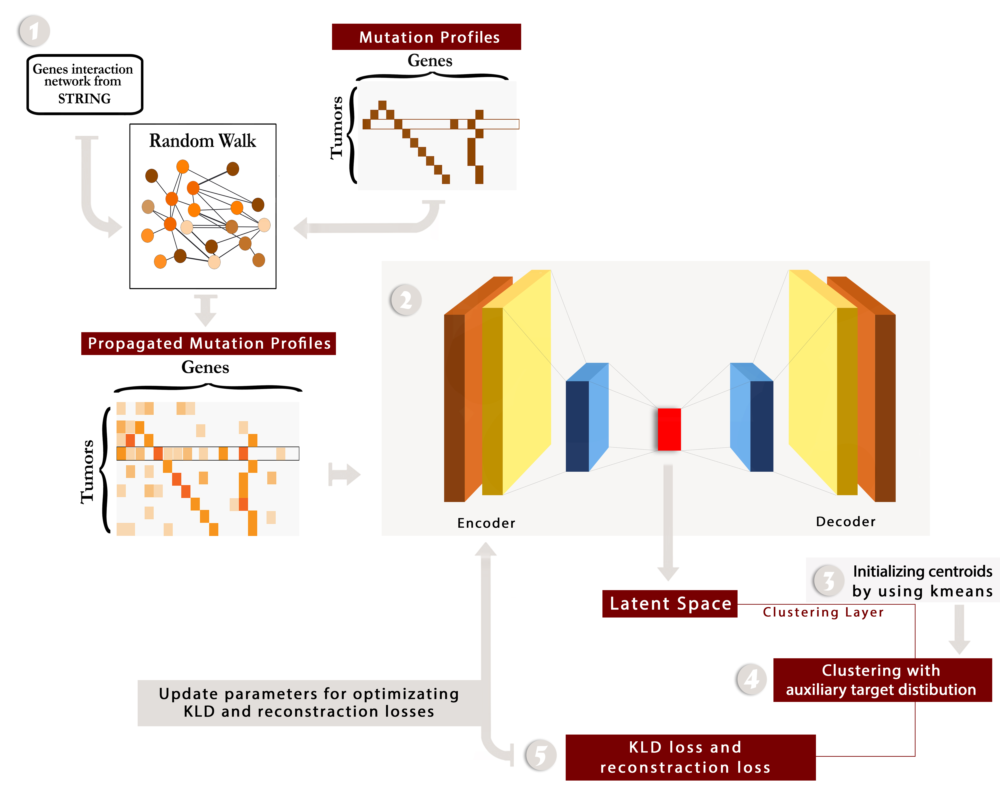

# Classifying Breast Cancer Molecular Subtypes Using Deep Clustering Approach

Cancer is a complex disease with a high rate of mortality. The characteristics of tumor masses are very heterogeneous; thus, the appropriate classification of tumors is a critical point in the correct treatment. A high level of heterogeneity has also been observed in breast cancer. Therefore, detecting the molecular subtypes of this disease is a worthwhile issue for medicine that could be facilitated using bioinformatics.
The aim of this study is to discover the molecular subtypes of breast cancer using somatic mutation profiles of tumors.
Nonetheless, the somatic mutation profiles are very sparse. To address this issue, a network propagation method is used on the gene interaction network to make the mutation profiles dense. Afterward, we used deep embedded clustering (DEC) method to
classify breast tumors into four subtypes. In the next step, gene signatures of each subtype are obtained by using Fisher exact test.
Clinical and molecular analyses, besides enrichment of genes in numerous biological databases, verify that the proposed method using mutation profiles can efficiently detect the molecular subtypes of breast cancer. Finally, a supervised classifier is proposed based on discovered subtypes to predict the molecular subtype of a new patient

## Getting Started



### Prerequisites and Installing packages

1. Install Python 3.x
2. Install Keras>=2.0.9
3. Install scikit-learn 
```
pip install keras
pip install scikit-learn   
```

### Materials

Data: We used breast cancer somatic mutation profiles collected by [Zhang et al.](https://github.com/wzhang1984/NBSS/tree/master/data). They have obtained 78 somatic mutation data of 861 breast tumors from TCGA. You can also find this data in "Data.txt". We propagated this profile using PPI network ("ppi.txt") and obtained "propagatedData.txt".

